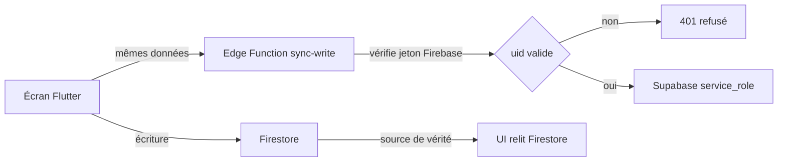
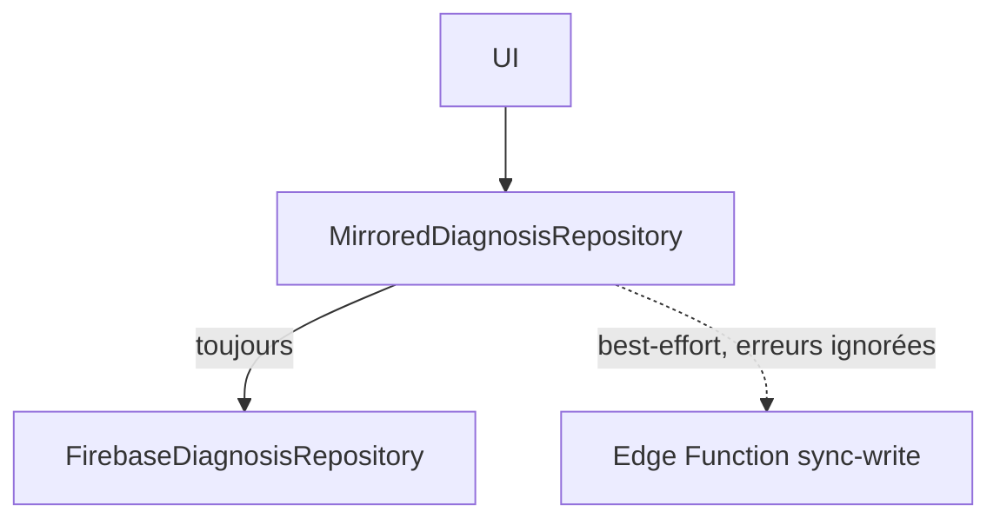

# Double écriture Firestore → Supabase

Décision : **Firestore reste la source de vérité.** Supabase reçoit une copie,
progressivement. L'application continue de lire et écrire dans Firestore.

## Périmètre

Première vague : `users` et `diagnoses` uniquement. Ce sont les deux seules
collections accessibles via une couche d'abstraction
([`lib/repositories/diagnosis_repository.dart`](../lib/repositories/diagnosis_repository.dart)).

`vendors`, `marketplace` et `signalements` sont hors périmètre pour l'instant :
leurs écrans accèdent à Firestore en direct, sans dépôt
([`marketplace_screen.dart:22`](../lib/screens/market/marketplace_screen.dart),
[`community_screen.dart:29`](../lib/screens/community/community_screen.dart)).
Les répliquer exigerait d'abord de les refactoriser.

## Le verrou à ne pas oublier

Les politiques RLS de Supabase s'appuient sur `auth.uid()`, qui ne lit que les
jetons d'authentification **Supabase**. Or les utilisateurs de KultivIA se
connectent avec **Firebase**. Donc `auth.uid()` renvoie `null` et toute
politique RLS basée dessus refuse l'écriture.

Conséquence : la réplication **ne peut pas passer par le client**. Elle passe
par une Edge Function qui utilise la clé `service_role` (contourne RLS) mais
qui vérifie elle-même le jeton Firebase.

La réplication ne doit **jamais** faire échouer l'écriture Firestore : elle est
en best-effort, ses erreurs sont journalisées puis ignorées.

## Schéma

Fichier : `supabase/migrations/0001_init.sql`

### Table `users`

| Colonne | Type | Rôle |
|---|---|---|
| `uid` | `text` primary key | uid Firebase (28 caractères) |
| `display_name` | `text` | |
| `photo_url` | `text` | |
| `role` | `text` | `farmer`, `vendor`, `advisor` |
| `locality` | `text` | |
| `crops` | `text[]` | |
| `language_code` | `text` | |
| `ai_language_code` | `text` | |
| `notifications_enabled` | `boolean` | |
| `voice_replies` | `boolean` | |
| `theme_mode` | `integer` | index de `ThemeMode` |
| `phone_number` | `text` | |
| `phone_country_code` | `text` | |
| `profile_completed` | `boolean` | |
| `source_updated_at` | `timestamptz` | **arbitre les conflits LWW** |
| `synced_at` | `timestamptz` | détecte ce qui n'est pas à jour |

### Table `diagnoses`

| Colonne | Type | Rôle |
|---|---|---|
| `id` | `text` primary key | `microsecondsSinceEpoch`, jamais réécrit |
| `uid` | `text` | clé étrangère logique vers `users.uid` |
| `date` | `timestamptz` | |
| `image_path` | `text` | chemin Firebase Storage, pas une URL |
| `input_text` | `text` | |
| `disease` | `text` | |
| `confidence` | `double precision` | borné entre 0 et 1 |
| `advice` | `text` | |
| `source_updated_at` | `timestamptz` | |
| `synced_at` | `timestamptz` | |

Index sur `diagnoses(uid, date desc)` pour servir l'historique, qui est trié
par date décroissante dans
[`firebase_diagnosis_repository.dart:43`](../lib/repositories/firebase_diagnosis_repository.dart).

### Règles de résolution de conflits

Une règle par collection. Un « last-write-wins » global serait faux.

| Collection | Nature | Règle | Justification |
|---|---|---|---|
| `diagnoses` | ajout seul | **append-only** | l'id est un timestamp en microsecondes, jamais réécrit |
| `users` | écrasement | **last-write-wins** | [`saveProfile`](../lib/services/auth/firebase_service.dart) écrase tout le document |

Pour que le LWW soit déterministe, il faut ajouter `updatedAt` à
[`UserProfile.toMap()`](../lib/models/user_profile.dart). **Sans ce champ, deux
écritures rapprochées sont indiscernables** - c'est le bug classique de la
double écriture.

### RLS et vue de contrôle

RLS activée sur les deux tables, refus par défaut. La clé `service_role`
contourne ces politiques ; le rôle public n'a aucun accès direct.

Vue `sync_gap` : compte les diagnostics Firestore attendus contre ceux présents
dans Supabase. C'est le tableau de bord à consulter avant de basculer la lecture
vers Supabase.

## Edge Function `sync-write`

Une seule fonction, un seul point d'entrée. Elle :

1. appelle [`requireUser()`](../supabase/functions/_shared/rodium.ts) qui accepte
   le jeton Firebase **et** le jeton Supabase ;
2. écrit avec la clé `service_role` ;
3. applique la règle de conflit de la collection concernée.

Le jeton Firebase est déjà vérifié localement (signature RS256 contre les
certificats publics Google, contrôle de `iss`, `aud`, `exp`).

## Côté client

Décorateur autour de l'implémentation Firestore existante, jamais à sa place.

- [`DiagnosisRepository`](../lib/repositories/diagnosis_repository.dart) est
  déjà une interface : le décorateur s'y branche sans toucher l'UI.
- `saveProfile` est appelé depuis **8 écrans** sans couche d'abstraction. Il faut
  créer `UserProfileRepository` pour pouvoir le répliquer de façon fiable.

Activation par `SIMULTANEOUS_WRITES`, **défaut `false`** : tant que le drapeau
est bas, le comportement est identique à aujourd'hui.

## Défaut connu, assumé

Il n'y a pas de `shared_preferences` dans `pubspec.yaml`. Si le téléphone est
hors ligne au moment de l'écriture, Firestore accepte la donnée mais Supabase
ne la reçoit pas.

Ce décalage est rattrapé par le backfill, relisant Firestore et réécrivant
Supabase de façon idempotente. Il y a donc une fenêtre d'incohérence, mais
aucune perte définitive.

Tant que l'application lit Firestore, cette fenêtre est invisible. Le jour du
basculement vers Supabase, il faudra vérifier `sync_gap` avant.

## Étapes

1. Migration SQL : tables, index, RLS, vue `sync_gap`
2. Edge Function `sync-write` : service_role + règle par collection
3. `updatedAt` dans `UserProfile.toMap()`
4. `UserProfileRepository` + implémentation Firestore
5. Décorateurs `MirroredUserProfileRepository` et `MirroredDiagnosisRepository`
6. Bascule dans `main.dart` sous `SIMULTANEOUS_WRITES`
7. Backfill idempotent + tests de résolution de conflits
8. Documentation dans `ARCHITECTURE.md`